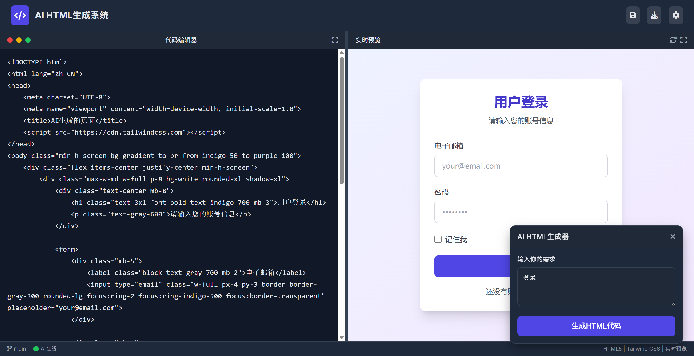

# Chat2Web 通过聊天生成并部署自己的系统



一个基于AI的HTML代码生成工具，通过自然语言描述快速生成响应式HTML页面代码。

## 功能特性

- 🎨 **AI代码生成** - 输入自然语言需求，自动生成符合要求的HTML代码
- 👁️ **实时预览** - 代码修改即时反映在预览窗口中
- ✂️ **面板调整** - 可拖拽分隔条调整代码编辑区和预览区大小
- 💾 **保存与导出** - 支持保存代码和导出HTML文件
- 🖥️ **响应式设计** - 生成的代码适配各种屏幕尺寸

## 技术栈

- [Vue 3](https://v3.vuejs.org/) + [TypeScript](https://www.typescriptlang.org/) - 前端框架
- [Tailwind CSS](https://tailwindcss.com/) - 实用优先的CSS框架

## 安装与使用

### 开发环境运行

1. 克隆仓库：
   ```bash
   git clone https://github.com/huangkemeng/Chat2Web.git
   cd chat2web
   ```

2. 安装依赖：
   ```bash
   npm install
   ```

3. 启动开发服务器：
   ```bash
   npm run dev
   ```

4. 打开浏览器访问 [http://localhost:3000](http://localhost:3000)

## 使用指南

1. 在右侧悬浮窗口中输入您的需求描述（如"创建一个登录表单"）
2. 点击"生成HTML代码"按钮
3. 系统将自动生成代码并显示在编辑器中
4. 实时预览区域将显示生成的页面效果
5. 可手动修改代码或继续生成新的内容


## 贡献指南

欢迎贡献代码！请遵循以下步骤：

1. Fork本项目
2. 创建您的特性分支 (`git checkout -b feature/AmazingFeature`)
3. 提交您的更改 (`git commit -m 'Add some AmazingFeature'`)
4. 推送到分支 (`git push origin feature/AmazingFeature`)
5. 提交Pull Request

## 许可证

本项目采用 [MIT License](LICENSE) 开源。

## 联系方式

如有任何问题或建议，请联系：

- 邮箱：huangkemeng@outlook.com
- GitHub: [@huangkemeng](https://github.com/huangkemeng)
